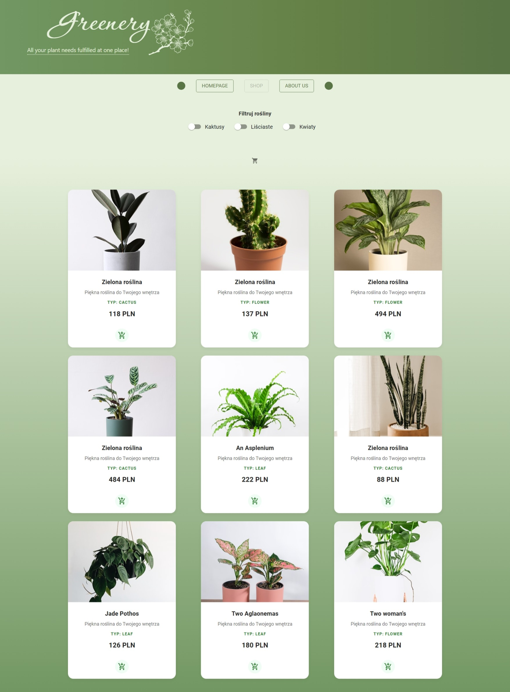
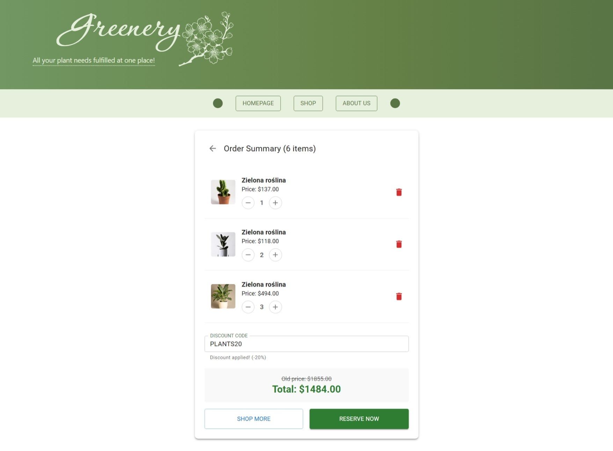
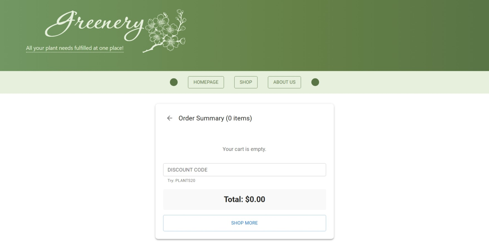

# Greenery v2.0 - Advanced React E-commerce

An enhanced version of the plant shop project. This iteration focuses on **Code Quality (QA)**, full testing coverage (E2E + Unit), advanced state management, and **Responsive Web Design (RWD)**.

## 🚀 Key Improvements vs v1.0

Compared to the initial version (MVP), the project has been significantly upgraded technically:

### 1. Responsiveness (RWD) & UI/UX
* **Mobile-First Grid**: Implemented a responsive product grid (transitioning from 3 columns on desktop to 1 on mobile) using Radix UI Grid.
* **Adaptive Navigation**: Rebuilt the `Header` and `Navbar` using CSS Media Queries and Flexbox to ensure readability and usability on small screens.
* **Micro-interactions**: Added button and product card animations using `react-spring` (hover effects, scaling).

### 2. Enhanced Business Logic
* **Cart Management**: Full shopping cart support – including adding, decrementing quantities, total removal of items, and empty state handling.
* **Discount System**: Implemented promo code logic (e.g., `PLANTS20`) that dynamically recalculates the order total.
* **Modal & State Management**: Utilized **Zustand** for global modal state management (reservation process) separated from the cart context.

### 3. Advanced Testing
Introduced a rigorous testing strategy covering two layers:
* **Vitest**: Unit and integration tests for components (mocking hooks, context, and APIs).
* **Playwright**: End-to-End (E2E) tests simulating complete user journeys in the browser.

---

## 🧪 Testing Strategy

The project includes 10 key E2E scenarios (Playwright) to ensure the stability of critical business features:

| ID | Test Case | Description (What is being tested?) |
|:---|:---|:---|
| **01** | **Purchase Flow** | Verification of the "Happy Path": adding a product to the cart and successful navigation to summary. |
| **02** | **Dynamic Filtering** | Ensuring that category selection (e.g., "Cacti") correctly filters the product list and removes non-matching items. |
| **03** | **Quantity Logic (+)** | Interactive incrementing of item quantity in the cart and verifying immediate UI updates. |
| **04** | **Quantity Logic (-)** | Decrementing quantity and ensuring automatic removal of the item from the cart upon reaching 0. |
| **05** | **Empty State** | Verification of "Your cart is empty" messages and disabling the reservation button when the cart is empty. |
| **06** | **Back Navigation** | Checking the functionality of the "Shop More" button to return from the cart to the shop while maintaining app state. |
| **07** | **Discount System** | Validation of the `PLANTS20` code – checking price recalculation (Old Price vs New Price) and success messages. |
| **08** | **Reservation Modal** | Verifying that the reservation modal (Zustand) opens correctly with the form present after clicking "Reserve Now". |
| **09** | **Deep Clean** | Ensuring the "delete" icon removes the product entry entirely, regardless of the quantity selected. |
| **10** | **Mobile Accessibility** | Functional test on a simulated mobile device (375px Viewport) – verifying accessibility of buttons and navigation. |

---

## 🛠️ Tech Stack

* **Core**: React 18, TypeScript, Vite
* **UI Frameworks**: Material UI (MUI), Radix UI Themes
* **State Management**: React Context API (Cart), Zustand (Modals)
* **Form Handling**: Formik
* **Animation**: React Spring
* **Testing**: Playwright (E2E), Vitest (Unit/Integration)

---

## ⚙️ Installing & Running

Follow the guide beneath to set up the project locally:

1. **Clone the repository:**
   ```bash
   git clone [https://github.com/werAnnOstrowska/projektReact.git](https://github.com/werAnnOstrowska/projektReact.git)
   cd projektReact
   ```

2. **Install dependecies**<br>

```
 npm install
```

3. **Setup environmental variables: create a .env file in the root directory**<br>

    ```
    touch .env
    # Open file and add your Unsplash API Key:
    VITE_UNSPLASH_CLIENT_ID=your_access_key_here
    ```


4. **Run the application**<br>

    ```
    npm run dev
    ```

5. **Run tests**<br>.

    Unit tests (Vitest):

    ```
     npm test

    ```

    To run e2e tests with playwright, run: 

    ```
     npm playwright test

    ```

    
### Dependencies

1. React router
2. React Query
3. Playwright
4. Vitest
5. Material Ui
6. Radix Ui
7. React Spring
8. react-chartjs-2
9. Formik
10. Zustand
11. env

### Photos




